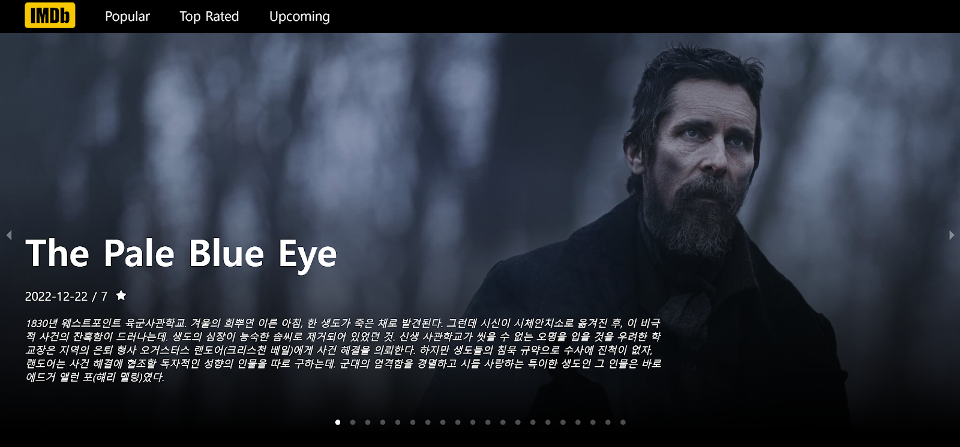
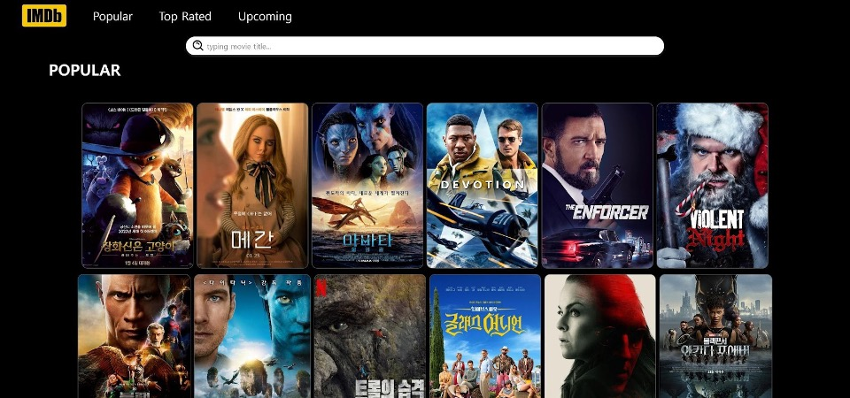
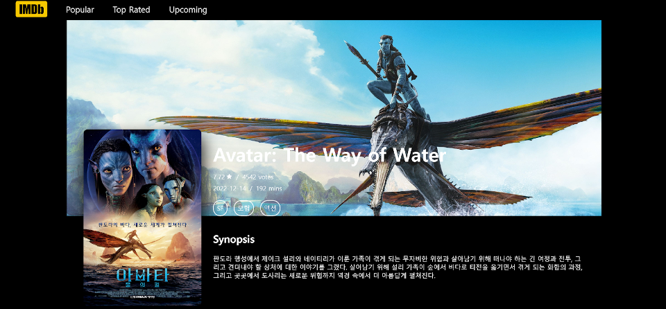

# [2기 / 프로젝트 3] 영화 서비스앱

## 프로젝트 소개 😎

React를 활용한 영화 서비스앱 구현 프로젝트 입니다.

## 영화 서비스앱 프로젝트
---
아래 요구사항과 결과물 기능을 확인하시고 실습 진행해주세요~ 감사합니다:)

## 상세 요구사항
---

### 외적 인터페이스 요구사항

|       구분       |                          내용                          |
| :--------------: | :----------------------------------------------------: |
|   요구사항 ID    |                       REQ-01-01                        |
|    요구사항명    |                 유형별 영화 목록 검색                  |
| 개요(목적, 내용) | 인기순/평점순/최신순 조건에 해당하는 영화 목록을 검색  |
|       입력       |            공통 헤더 컴포넌트의 링크 클릭             |
|       출력       | 'Popular'/'Top Rated'/ 'Upcoming'영화 목록 페이지 제공 |

|       구분       |                        내용                         |
| :--------------: | :-------------------------------------------------: |
|   요구사항 ID    |                      REQ-01-02                      |
|    요구사항명    |                 특정 영화 상세조회                  |
| 개요(목적, 내용) | 영화 데이터의 고유한 순번에 해당하는 영화 상세 조회 |
|       입력       |            특정 영화 카드내의 링크 클릭             |
|       출력       |                영화 상세 페이지 제공                |

### 기능적 요구사항

#### A. React.js 구현

- 1-0 디렉토리 구성

  - 디렉토리 설계는 기능(관심사) 별로 나누어 구성 예) 컴포넌트, 페이지

- 1-1. Carousel 구성

  - 파일 : pages/Home.jsx (URL경로 : “/”)
  - 라이브러리 : react-responsive-carousel (https://github.com/leandrowd/react-responsive-carousel)
  - 내용 : (메인 화면내에서) 매 3초마다 자동 페이징, 페이지 네이션 및 좌/우 아이콘을 통한 수동 페이징, 해당 영화 클릭 시 상세페이지로 이동.

- 1-2. Skeleton 구성

  - 파일 : pages/Movie.jsx (URL경로 : “/movie/{type}”), components/Card.jsx
  - 라이브러리 : react-loading-skeleton (https://github.com/dvtng/react-loading-skeleton)
  - 내용 : (영화 리스트내에서) API요청중에 카드영역내의 이미지를 일시적으로 1.5초동안 Skeleton 컴포넌트로 렌더링.

#### B. API 연동

- 2-1. 사전 TMDB API KEY 발급 (소요시간 10분이내)

  - 절차1) https://www.themoviedb.org/?language=ko 회원가입
  - 절차2) 상단의 ‘프로필’ 클릭 → ‘설정’ 클릭 → 좌측 메뉴의 ‘API’ 클릭 후 정보 입력 후 발급받기
  - 절차3) “API 키 (v3 auth)”에 해당하는 키 값 복사 후 .env파일에 저장

- 2-2. 영화 검색 API

- https://api.themoviedb.org/3/movie/{TYPE}?language=ko-KR&api_key={API_KEY} URL 구성

  - TYPE : “popular”, “top_rated”, “upcoming” 중 택 1을 입력
  - API_KEY : 발급받은 API의 키 입력

- 2-3. 특정 영화 조회 API

  - https://api.themoviedb.org/3/movie/{MOVIE_ID}?language=ko-KR&api_key={API_KEY} URL 구성
    - MOVIE_ID : movie데이터의 id 필드 입력
    - API_KEY : 발급받은 API의 키 입력

C. 기능 구현 참고

- API 연동은 마지막 단계로 그전 구현에서는 가데이터를 사용하여 진행 (movie.txt 첨부 파일 참고)

## 결과물 예시 및 기능
---

### [메인 페이지]

### [영화 리스트 페이지]

### [영화 상세 페이지]

### [ TMDB API 연동 ]

(기능 1,2,3) API를 통한 영화 리소스 페이지들을 제공 (메인페이지 / 유형별페이지 / 상세페이지)

### [ Carousel 컴포넌트 구성 ]

(기능 6) Home 화면의 여러 이미지들에 대한 정보를 화면 너비에 맞는 Carousel 컴포넌트로 렌더링

### [ Skeleton 컴포넌트 구성 ]

(기능 7) API에 응답 대기중인 경우, Skeleton 컴포넌트로 렌더링

### [ 페이지별 라우터 구성 ]

(기능 4) 브라우저의 URL에 해당하는 각 페이지별 컴포넌트들과 공통 헤더를 렌더링

## 고도화
---

### 도전과제 (Challenge)

- 열람한 영화 포스터 내역들 히스토리 보기

- 관심있는 영화포스터 즐겨찾기 추가 기능

- 페이지네이션을 통한 리스트 검색 기능 (문서내의 API 검색옵션 쿼리문을 참고)

  - [API 검색 옵션 쿼리문](https://developers.themoviedb.org/3/movies/get-movie-details)